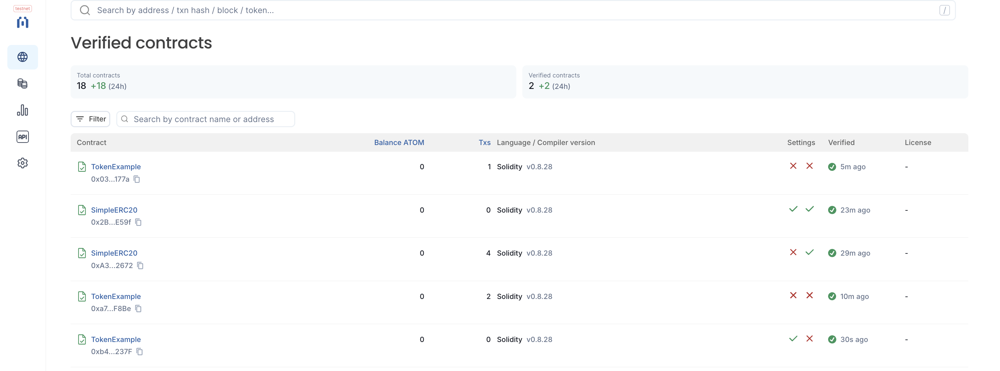

# Issue Report

## Issues

### 1. The number of ERC20 token holders and transfers is not correctly displayed

## Test Cases

### Checked

- [x] After starting the Blockscout instances, are there any abnormal logs output from evmd when started with the `--log-level debug` option?
- [x] Search for a transaction hash and confirm correct details (From/To/Gas).
  - [x] ✅ Details
  - [x] ✅ Token transfers
  - [x] ✅ Internal txs
  - [x] ✅ Logs
  - [x] ✅ State
  - [x] ✅ Raw trace
- [x] Look up the ERC-20 contract address to see token info and holders.
  - [x] ✅ Are the token metdata is displayed corectly?
    - [x] ✅ Name
    - [x] ✅ Symbol
    - [x] Decimals
  - [x] Are the token state is displayed correctly?
    - [x] ⚠️ Holders
    - [x] ⚠️ Transfers
- [x] Verify contract source code via **Verify & Publish** process.
  - [x] Foundry
  - [x] Hardhat
- [x] Charts and Stats

## Proof of Test

### Transaction Details

### Contract Verification

Verified contrdacts

Verify contract with foundry

Verify contract with hardhat

### Charts and Stats

