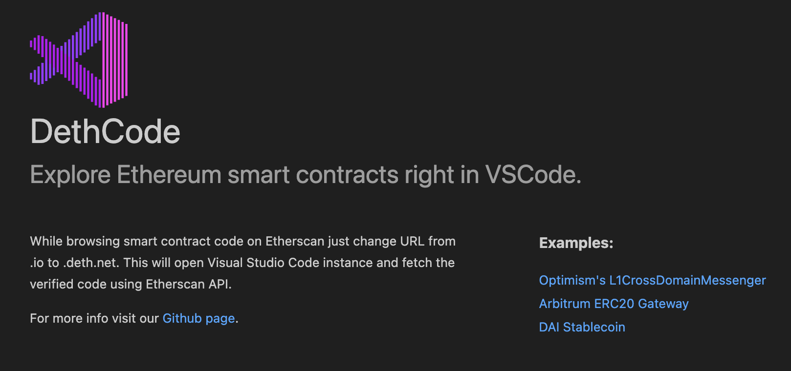

# DethCode Compatibility Check with Custom Blockchain

## Overview

This document outlines the results of testing **DethCode** with a custom blockchain environment.  
The goal of this investigation was to verify whether **DethCode** could retrieve contract source code and perform its analysis functionalities on non-Ethereum blockchains.

## Key Findings

- **DethCode** currently **only supports the Ethereum mainnet and its standard testnets** (e.g., Goerli, Sepolia).
- Custom or non-Ethereum-based blockchains are **not supported** at this time.

    DethCode displayed the following:

   _Insert screenshot here:_  
   

## Conclusion

At the time of this testing, **DethCode does not support custom blockchains**, even if they are EVM-compatible.  
It is limited to Ethereum mainnet and its official testnets.

### Recommendation

- For contract analysis on custom blockchains, consider alternative tools that support arbitrary RPC endpoints (e.g., Hardhat, Foundry, Tenderly, etc.).
- Monitor DethCode’s future updates for potential multi-chain support.

## Additional References

- [DethCode GitHub Repository](https://github.com/dethcrypto/dethcode)
- [DethCode Documentation](https://github.com/dethcrypto/dethcode/blob/main/README.md)

