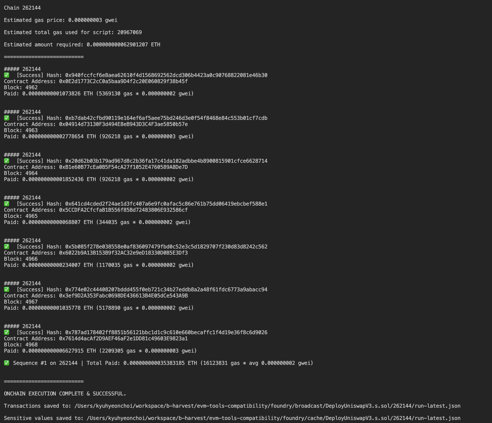
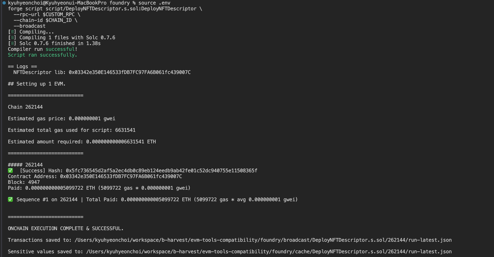

# Issue Report

## Issues

### 1. `--slow` flag for sequencial commit for txs

When sending multiple transactions in a single script, the `--slow` flag is mandatory because the execution order of the transactions isn’t guaranteed. Without `--slow`, the nonces in the transactions won’t line up correctly and you’ll get nonce‐mismatch errors.

#### Example: Deploy Uniswap V3 Contracts

With --slow flag



without --slow flag

```bash
Error: Failed to send transaction

Context:
- server returned an error response: error code -32000: invalid nonce; got 50, expected 49: invalid sequence: invalid sequence
```

```bash
forge --help

...
        --slow
          Makes sure a transaction is sent, only after its previous one has been confirmed and succeeded
```

## Proof of Test

### Deploy Uniswap V3 Contracts

Deploy `NFTDescriptor` library



Deploy other Uniswap V3 contracts


