# Issue Report

## Issues

### 1. `cast call` command use geth version >= 1.13.x

When querying the state values of an ERC20 contract using `cast call`, an error is displayed stating that opcode `0x5e` is undefined when calling the `name()` or `symbol()` methods that use data locacion specifier is `memory`.

It seems that `cast call` command uses `MCOPY` opcode ([`0x5e`](https://www.ethervm.io/#5E)).

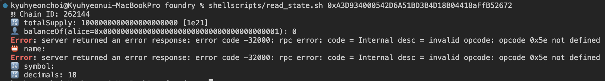

When use `.s.sol` script with `forge script`, it works well.

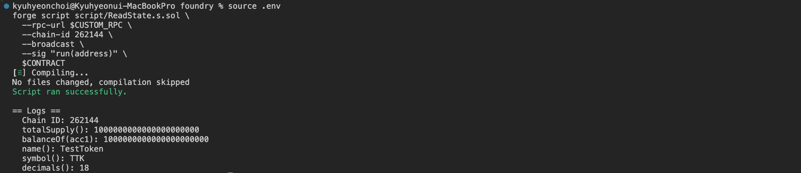

Even when checking the name and symbol from blockscout, it is not displayed

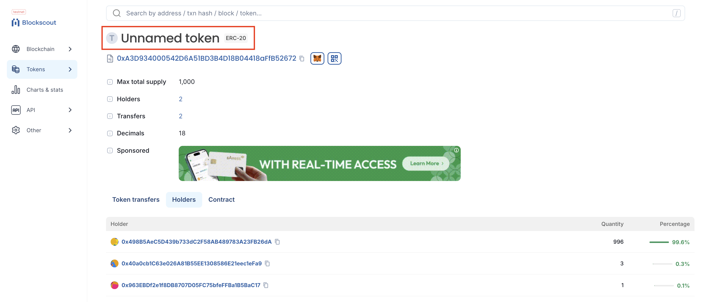

### 2. `--slow` flag for sequencial commit for txs

When sending multiple transactions in a single script, the `--slow` flag is mandatory because the execution order of the transactions isn’t guaranteed. Without `--slow`, the nonces in the transactions won’t line up correctly and you’ll get nonce‐mismatch errors.

### Example: Deploy Uniswap V3 Contracts

With --slow flag

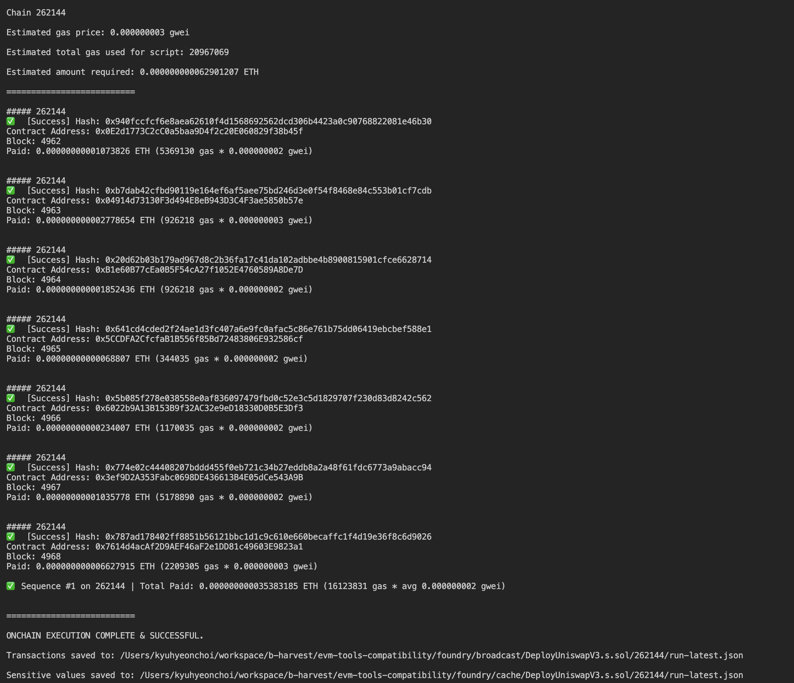

without --slow flag

```bash
Error: Failed to send transaction

Context:
- server returned an error response: error code -32000: invalid nonce; got 50, expected 49: invalid sequence: invalid sequence
```

```bash
forge --help

...
        --slow
          Makes sure a transaction is sent, only after its previous one has been confirmed and succeeded
```

## Test Cases

### Checked

- Deploy Conracts
  - ERC20
    - [x] ✅ Deploy a minimal ERC-20 contract (e.g., using OpenZeppelin’s ERC20 as a reference).  
    - [x] ✅ Ensure the deployment targets the custom chain via RPC (e.g., `forge create --rpc-url <CUSTOM_RPC> ...`).  
    - [x] ✅ Confirm the transaction hash, block number, and contract address.  
  
  - UniswapV3
    - [x] ✅ Deploy UniswapV3 Contracts

- Read State via Foundry  
  - [x] ❌ Use `test call` (or an equivalent command) to read a function such as `totalSupply()`, `balanceOf(<address>)`, or `symbol()` from the deployed ERC-20 contract.  
  - [x] ✅ Use `forge script` (or an equivalent command) to read a function such as `totalSupply()`, `balanceOf(<address>)`, or `symbol()` from the deployed ERC-20 contract.  
  - [x] ✅ Verify that correct data (balances, token name/symbol, etc.) is returned from the node.  
  - [x] ✅ Check chain ID or network metadata if available, to confirm you are indeed connected to the correct chain.  

- Write State via Foundry  
  - [x] ✅ Perform a token transfer using a Foundry command (e.g., using `forge script` or `cast send`) that calls `transfer(<to>, <amount>)`.  
  - [x] ✅ Confirm the transaction is successfully mined on the custom chain (check the transaction hash and block explorer).  
  - [x] ✅ Re-check balances (e.g., `balanceOf`) to ensure the transfer actually took place on-chain.  

- Error Handling & Edge Cases  
  - [x] ✅ Attempt a transfer that exceeds the sender’s balance (to confirm error behavior).  
  - [x] ✅ Validate that the node returns a revert or appropriate error message.  
  - [x] ✅ Document any unexpected RPC or node errors (time-outs, mismatched chain ID, etc.).

- [x]  Simulate transactions

  - [x] Transfer erc20
  
  ```shell
  cast run --rpc-url http://localhost:8545 0xd52e212ccdaa85b80146fce23693e1e17aa0806b5a0b568916c73e4c7c0a92d4
  Executing previous transactions from the block.
  Traces:
    [12866] 0xd37f26d05157cfF9944Af072Bc8eA2531278e527::transfer(0x40a0cb1C63e026A81B55EE1308586E21eec1eFa9, 1000000000000000000 [1e18])
      ├─ emit Transfer(param0: 0x498B5AeC5D439b733dC2F58AB489783A23FB26dA, param1: 0x40a0cb1C63e026A81B55EE1308586E21eec1eFa9, param2: 1000000000000000000 [1e18])
      └─ ← [Return] 0x0000000000000000000000000000000000000000000000000000000000000001
  
  ```
  
  - [x] Deploy Contracts
  
    - [x] ERC20 Contract

      ```bash
      cast run --rpc-url http://localhost:8545 0x9dbd3dfcdb4f9abe15460b7fcbfcafd107746bb399fba9a33758007791eb63c0
      Executing previous transactions from the block.
      Traces:
        [602412] → new <unknown>@0xf111fE1dD8B81d69CA8165A2b733429CE6C66C84
          ├─ emit OwnershipTransferred(param0: 0x0000000000000000000000000000000000000000, param1: 0x498B5AeC5D439b733dC2F58AB489783A23FB26dA)
          ├─ emit Transfer(param0: 0x0000000000000000000000000000000000000000, param1: 0x498B5AeC5D439b733dC2F58AB489783A23FB26dA, param2: 1000000000000000000000 [1e21])
          └─ ← [Return] 2432 bytes of code

      Transaction successfully executed.
      Gas used: 711114
      ```

    - [x] Uniswap V3 Contracts

### Unchecked

- Gas Estimation Verification  
  - [ ] Use `forge estimate-gas` to fetch the estimated gas for each transaction and compare it against the actual gas used.  

- Block Number Zero Handling  
  - [ ] Call `eth_getBlockByNumber("0x0", true)` and verify whether the node returns an error, `null`, or a valid block.  

- Nonce Management & Collision Test  
  - [ ] Send multiple transactions in quick succession (without `--slow`) to ensure nonces are handled correctly and no collisions occur.  

- EIP-1559 vs. Legacy Transaction Type Compatibility  
  - [ ] Test both legacy and dynamic-fee (`type=0x2`) transactions to confirm the chain and Foundry support both formats.  

- Revert Reason & Trace Accuracy  
  - [ ] Trigger a revert inside a contract call and verify that Foundry surfaces the correct revert reason and call trace.  

- Event Log Filtering & Verification  
  - [ ] After running a script, use `forge logs` or `eth_getLogs` to ensure that events are correctly emitted and retrievable.  

- RPC Timeout & Retry Behavior  
  - [ ] Configure a short `--rpc-timeout` and observe how Foundry handles time-outs and whether it retries or fails gracefully.  

- Chain ID Auto-Detection  
  - [ ] Omit any manual `chain-id` configuration and verify that Foundry correctly detects and uses the chain ID from the node.  

- Contract Block Data Usage  
  - [ ] Deploy and call a contract that reads `block.number` and `block.timestamp`, ensuring values are populated accurately (given CometBFT’s genesis at block 1).  

- Static Call vs. Transaction Consistency  
  - [ ] Compare results between `cast call` (static) and `cast send` (transaction) for the same read-only function to confirm consistency.

## Proof of Test

### Network Info

`cast call`

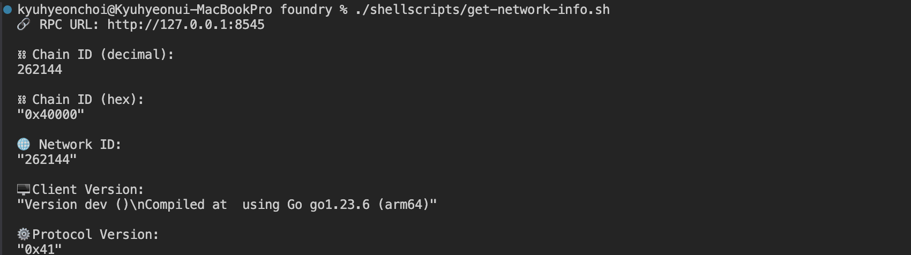

`forge script`

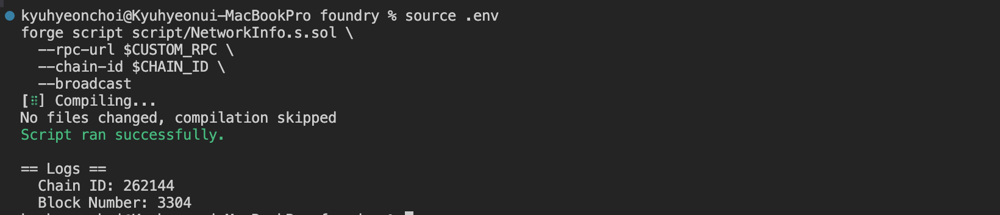

### Deploy Contracts  

#### ERC20

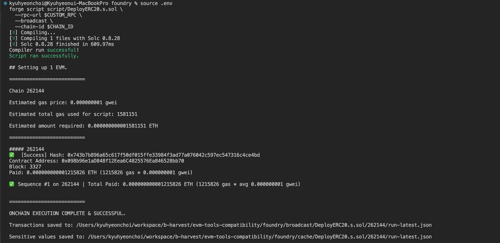

#### Uniswap V3 Contracts

Deploy `NFTDescriptor` library

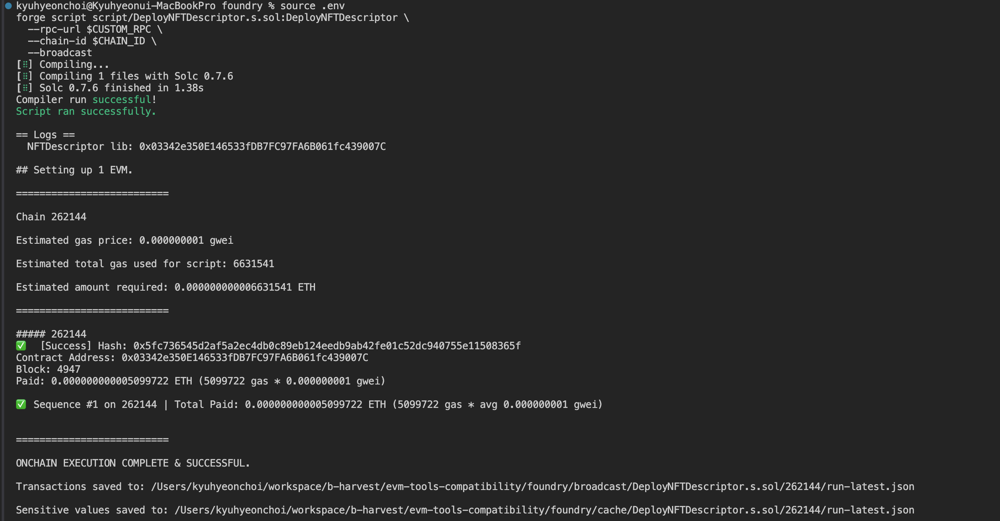

Deploy other Uniswap V3 contracts


### Read State

`cast call`


`forge script`


### Write State

`cast send`

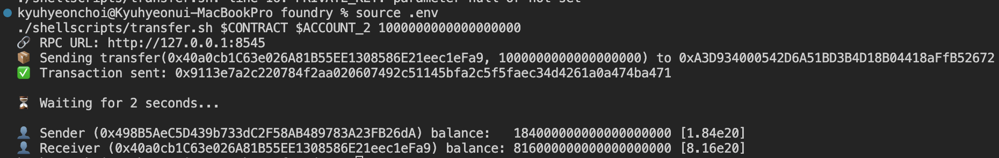

`forge script`

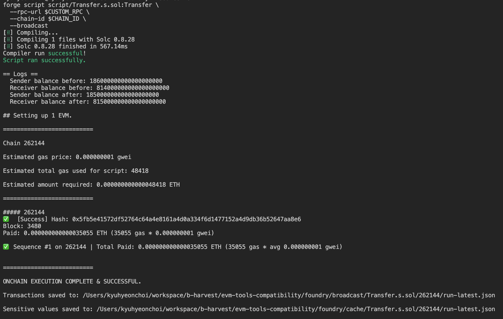

### Transfer Revert

`cast send`

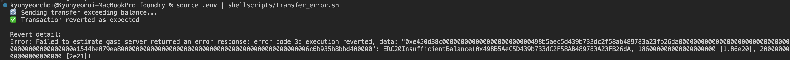

`forge script`

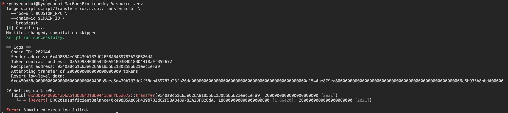
