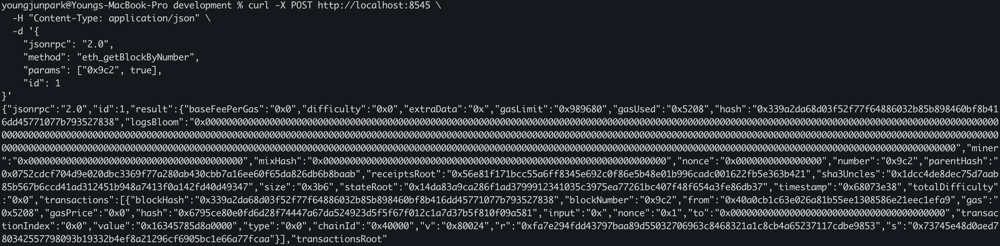
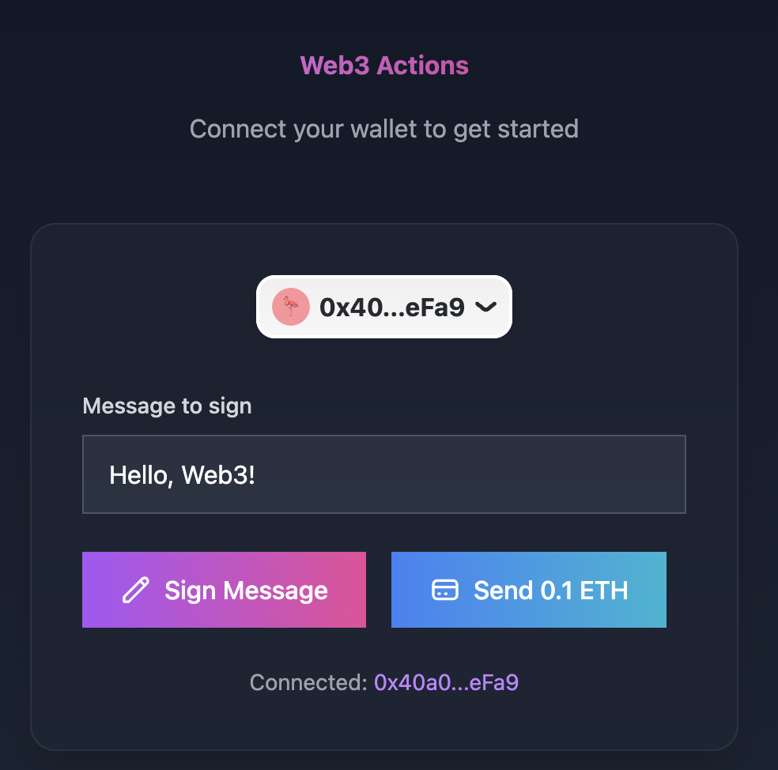

## ✅ WalletConnect Integration Test with Local EVM Chain

This PR documents the successful integration of WalletConnect with a locally running custom EVM-compatible chain, and verifies that transactions can be executed and finalized via mobile wallet connection.

---

### ⚙️ Test Setup

- **Chain ID**: `0x40000`
- **RPC Endpoint**: `https://<ngrok-subdomain>.ngrok-free.app`
- **Local Node**: Tendermint + EVM Layer (RPC on `localhost:8545`)
- **Frontend**: Test DApp using RainbowKit + wagmi
- **Mobile Wallets**: MetaMask ✅, OKX ✅  (manual setup required)

---

### ✅ Checklist Overview

#### 1. **Local Chain Setup**
- ✅ (A) Launched EVM-compatible node locally (Tendermint + RPC :8545)
- ✅ (B) Verified `eth_getBlockByNumber`, `eth_sendTransaction` functionality
- ✅ (C) Confirmed custom chain ID (`0x40000`) is being used consistently

#### 2. **WalletConnect**
- ✅ (A) Set up a test DApp locally that shows a WalletConnect QR code
- ✅ (B) Used MetaMask mobile to scan and connect successfully
- ✅ (C) Executed a test transaction (token transfer to zero address)
- ✅ (D) Confirmed on-chain inclusion and success via RPC

#### 3. **Transaction Handling**
- ✅ (A) Verified transaction hash is returned after send
- ✅ (B) Checked inclusion in block via `eth_getBlockByNumber`
- ✅ (C) Checked execution result via `eth_getTransactionReceipt`

#### 4. **Compatibility Notes**
- ⚠️ On mobile wallets (e.g. MetaMask, OKX), **testnet chains exposed via localhost or ngrok are not automatically recognized**
- ✅ Chain was manually added in mobile wallet using `chainId`, `rpcUrl`, and `currency` metadata
- ✅ Once manually added, connection and transaction worked as expected
- 💡 For broader compatibility, consider switching to more common devnet `chainId` such as `31337`

---
### Call transaction



### Web UI test


### 🔎 Verified Transaction (Block #2498)

**Tx hash:** `0x6795ce80e0fd6d28f74447a67da524923d5f5f67f012c1a7d37b5f810f09a581`  
**Block hash:** `0x339a2da6...27838`  
**Recipient:** `0x000...000`  
**Value:** `0.1 ETH`  
**Status:** `0x1 (success)`

<details>
<summary>🔍 eth_getBlockByNumber Response (truncated)</summary>

```json
{
  "number": "0x9c2",
  "transactions": [
    {
      "hash": "0x6795ce80e0fd6d28f74447a67da524923d5f5f67f012c1a7d37b5f810f09a581",
      "from": "0x40a0cb1c63e026a81b55ee1308586e21eec1efa9",
      "to": "0x0000000000000000000000000000000000000000",
      "value": "0x16345785d8a0000",
      "chainId": "0x40000"
    }
  ]
}
```

</details>